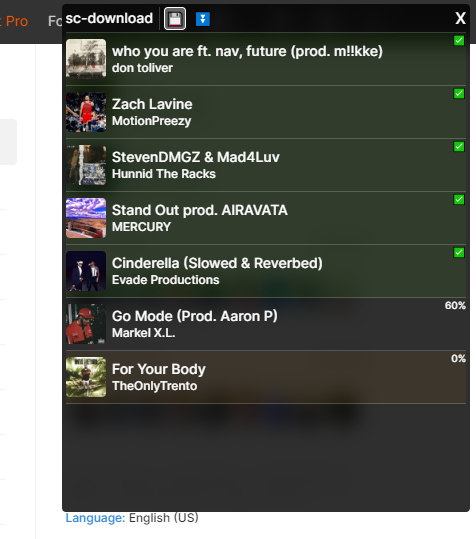

# sc-download

**A userscript to download SoundCloud tracks.** Automatically tags MP3 files with metadata and album art.

Listens in on the network requests made by the SoundCloud web app and saves the data to download tracks. The script will add a button to the top right of the page, whit opens a menu. The menu lists all the tracks that have been fetched by the web app, and allows you to download them.

To add tracks to the list, hover over them anywhere in the app or play them. The script will intercept the network requests and add the track to the list.

To download a track, click on the download button next to it. The script will download it as an MP3 file. Or you can download all tracks at once by clicking the "💾" in the top.
